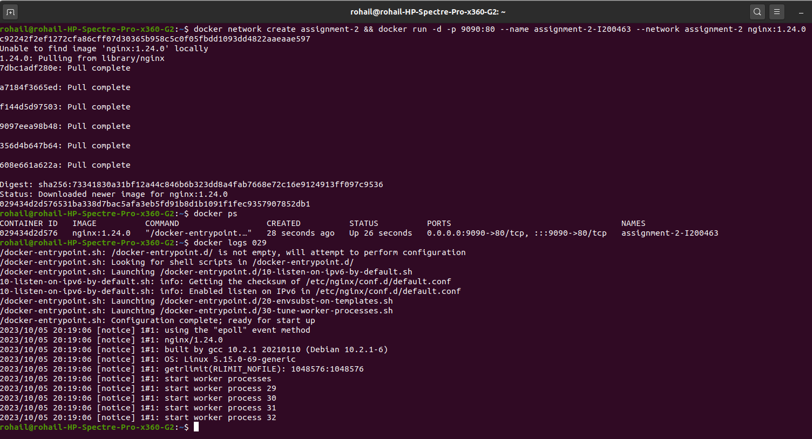

# Rohail Zubair  20I-0463
## Assignment # 2 - Task 2
**Q1) Explain Docker Containers vs VMs**

Ans) Following are some of the distingushing features between Docker Containers and VMs: 
1- Containers provide OS-level virtualization whereas VMs provide Hardware-level virtualization.
2- In Containers, Abstraction is at the application layer that packages code and dependencies together whereas in VMs, there is abstraction of physical hardware turning one server into many.
3- Containers share hardware and host OS-Kernal whereas VMs share harware but have their own OS.
4- Each Container runs as an isolated process in user space whereas each VM includes a full copy of an OS that is not shared.
5- A Container has a burstable compute and memory whereas a VM has a static compute and memory.
6- A Container is light weighted (takes less space) whereas a Vm is heavy weighted (takes more space).
7- A Container is Fast to boot whereas a VM is slow to boot.
8- A Container is less secure than a VM.     

-------------------------------------------------------------------------------------------------------------------

**Q2) Write command to create a docker container in detached mode with name assignment-2-<ROLL_NUMBER> running on host port 9090 and container port 80 using image nginx with version 1.24.0 on a custom network named assignment-2**

Ans) Following are the two ways to write the above command: 

In 2 commands:

> docker network create assignment-2 

> docker container run -d --publish 9090:80 --name assignment-2-I200463 --network assignment-2 nginx:1.24.0

In a Single command:

> docker network create assignment-2 && docker run -d -p 9090:80 --name assignment-2-I200463 --network assignment-2 nginx:1.24.0

--------------------------------------------------------------------------------------------------------------------

**Q3) Run the above command and add screenshot of it and share the logs**
Ans) 

